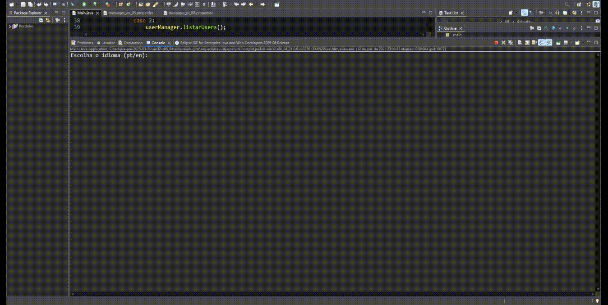

# 📋 InfoSave — Cadastro de Usuários em Java

Sistema desktop simples feito em **Java 21** para cadastro de usuários com nome e idade, gerenciamento via console e exportação de lista para PDF.  
Suporte a **multi-idioma (Português/Inglês)** via `ResourceBundle`.

---

## 📸 Demonstração



---

## 📌 Tecnologias

- Java 21
- Eclipse IDE 2025-06
- iTextPDF (para exportação de PDF)
- ResourceBundle (multi-idioma)
- ScreenToGif (para gravação do GIF)

---

## 🎨 Funcionalidades

- 📥 Adicionar usuário
- 📜 Listar usuários
- ❌ Remover usuário pelo nome
- 🗑️ Remover todos os usuários
- 📄 Exportar usuários cadastrados para PDF
- 🌐 Suporte a mensagens em **Português e Inglês**

---

## 📚 Multi-idioma

Os textos da aplicação estão organizados em arquivos:
- `messages_pt_BR.properties` (português)
- `messages_en_US.properties` (inglês)

O idioma é definido no início da execução.

---

## 🚀 Como executar

1. Certifique-se de ter o **Java 21** instalado.
2. Compile os arquivos:

```bash
javac -d bin src/main/*.java
