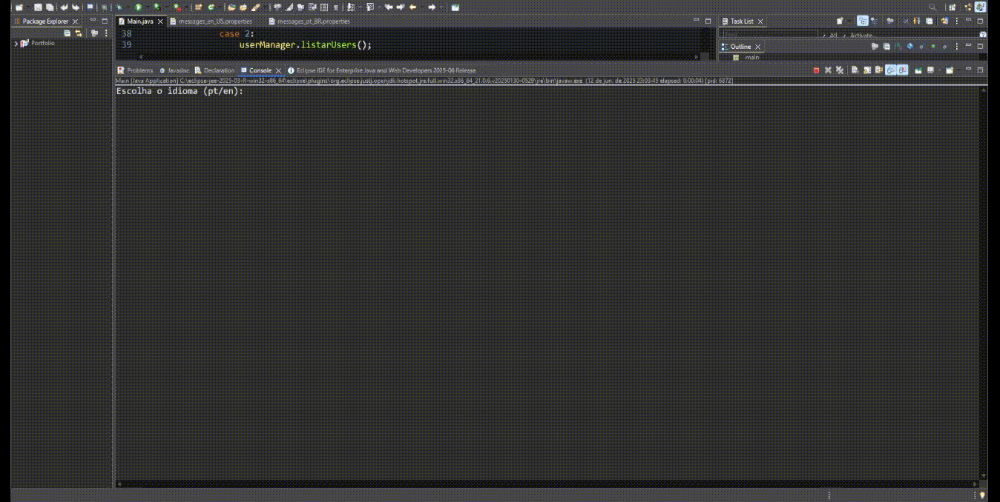

# 📋 InfoSave — Java Desktop User Manager

Sistema desktop simples desenvolvido em **Java 21** para cadastro de usuários, gerenciamento via console e exportação de lista para PDF.  
✅ Suporte a **multi-idioma (Português/Inglês)** via `ResourceBundle`.

A simple desktop system developed in **Java 21** for user registration, console management, and exporting user list to PDF.  
✅ Supports **multi-language (Portuguese/English)** via `ResourceBundle`.

---

## 📸 Demonstração / Demo



---

## ⚠️ Requisitos obrigatórios

Para compilar e executar este projeto corretamente, é necessário:

- ✅ **Java 21 instalado e configurado no PATH**
  - Você pode baixar em: [https://adoptium.net/pt-br/temurin/releases/?version=21](https://adoptium.net/pt-br/temurin/releases/?version=21)
  - Confirme a versão instalada com:
    ```bash
    java -version
    ```

- ✅ **Biblioteca iText 2.1.7** para geração de arquivos PDF
  - Baixe em: [https://mvnrepository.com/artifact/com.lowagie/itext/2.1.7](https://mvnrepository.com/artifact/com.lowagie/itext/2.1.7)
  - Coloque o arquivo `itext-2.1.7.jar` dentro da pasta `/lib/` do projeto

---

## 📌 Compilação com dependência iText (Java 21)

**No terminal, dentro da pasta `src/`:**

```bash
javac -cp "../lib/itext-2.1.7.jar;../bin" -d ../bin main/*.java
```

## 📌 Execução com dependência iText (Java 21)

**No terminal, dentro da pasta `src/`:**

```bash
java -cp "../lib/itext-2.1.7.jar;../bin" main.Main
```

⚠️ **Importante:** Tentar rodar com Java 8 ou versões antigas causará erro `UnsupportedClassVersionError` pois o projeto foi compilado com Java 21.

---

## 📌 Tecnologias / Technologies

- Java 21
- Eclipse IDE
- iTextPDF (PDF export)
- ResourceBundle (multi-language)
- Open Broadcaster Software (OBS recording)

---

## 🌐 Idiomas / Languages Supported

🇧🇷 **Português (pt-BR)**  
🇺🇸 **English (en-US)**  

O idioma é escolhido no início da execução:  
The language is chosen at program start:

```
Escolha o idioma (pt/en):
Choose the language (pt/en):
```

---

## 📥 Funcionalidades / Features

- 📥 Adicionar usuário / Add user
- 📜 Listar usuários / List users
- ❌ Remover usuário / Remove user
- 🗑️ Remover todos os usuários / Remove all users
- 📄 Exportar lista para PDF / Export list to PDF
- 🌐 Multi-idioma via ResourceBundle / Multi-language support via ResourceBundle

---

## 📦 Estrutura / Project Structure

```
/src/
  /main/
    Main.java
    User.java
    UserManager.java
    PdfExporter.java
    Mensagens.java
/lib/
  itext-2.1.7.jar
/assets/
  demo.gif
messages_en_US.properties
messages_pt_BR.properties
README.md
```

---

## 📈 Status

✅ **Projeto finalizado e funcional / Project completed and working**

---

## ✍️ Autor / Author

**Luanc210**  
[GitHub](https://github.com/Luanc210)
